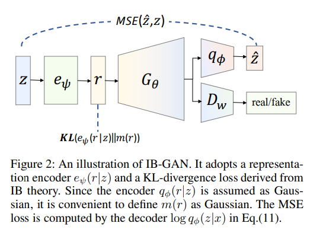
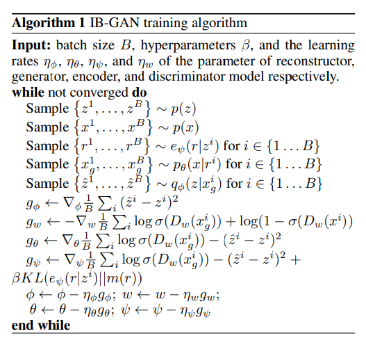

# IB-GAN: Disentangled Representation Learning with Information Bottleneck GAN

Pytorch implementation of [IB-GAN, AAAI 2021](https://ojs.aaai.org/index.php/AAAI/article/view/16967)   
Official Repository is [here](https://github.com/insuj3on/IB-GAN)  

---  
## Architecture of IB-GAN


## Training Algorithm of IB-GAN

  
--- 

## Dependencies
To resolve the dependencies, run command(require Anaconda)
```
conda create --name <env> --file requirements.txt  
```
  
--- 

## Datasets

### Datasets
1. dsprites
2. CelebA
3. 3DChairs

### Download Datasets
for dsprites,
```
# Download dsprite dataset
sudo bash download.sh dsprites
```

for CelebA,
```
# Download CelebA dataset
sudo bash download.sh 3DChairs
```

for 3D Chairs
```
# Download 3D Chairs dataset
sudo bash download.sh CelebA

```
---
## Train/Test Network
With following command and config file, you can train and test the network.
```
python main.py <config file path>
```
### Config
Here is the sample config file. Please follow the template.   
Set **train: 1** for train, **train: 0** for test.  
In *configs* directory, there are configs files I used for each dataset.   
```
{
    "id": "IBGAN-dsprites",
    "model": "IBGAN",
    "dataset": "dsprites",
    "path_to_data": "./data/dsprites",
    "train" : 1,  
    "resolution": 64,
    "z_dim": 16,
    "r_dim": 10,
    "ngf": 16,
    "ndf": 16,
    "nc": 1,
    "weight_init": "normal",
    "training": {
        "max_iters": 1.5e5,
        "noise_iters": 1e5, 
        "resume_iters": 0,
        "restored_model_path": "",
        "batch_size": 128,
        "lr_E": 5e-5,
        "lr_G": 5e-5,
        "lr_Q": 5e-5,
        "lr_D": 1e-6,
        "weight_decay": 0.0,
        "beta1" : 0.5,
        "beta2" : 0.999,
        "milestones": [], 
        "scheduler_gamma": 0.5,
        "gan_loss_type": "GAN",
        "opt_type": "RMS",
        "label_smoothing": 0,
        "instance_noise": 1,
        "noise_start": 1.0,
        "noise_end": 0.0,
        "start": -1.1,
        "end": 1.1,
        "steps": 10,
        "gan_weight": 1.0,
        "upper_weight": 0.141,
        "print_freq": 100,
        "sample_freq": 2000,
        "model_save_freq": 5000
    },
    "test":{
        "test_iters": 50000,
        "batch_size" : 1,
        "test_seed" : [42, 62, 1024, 72, 92] ,
        "start": -3.0,
        "end": 3.0,
        "steps": 10,
        "test_path": ""
    }
}
```

---
## Sample Results
### 1. Dsprites

### 2. CelebA

### 3. 3D Chairs


---

## Acknowledgement
I appreciate the helps from the author of the paper, Insu Jeon(insuj3on@gmail.com)

Also, I got help from these repositories
1. https://github.com/insuj3on/IB-GAN  (IB-GAN aaai version)
2. https://github.com/yunjey/stargan
3. https://github.com/1Konny/FactorVAE
4. https://github.com/odegeasslbc/pytorch-IBGAN  (IB-GAN arxiv version)